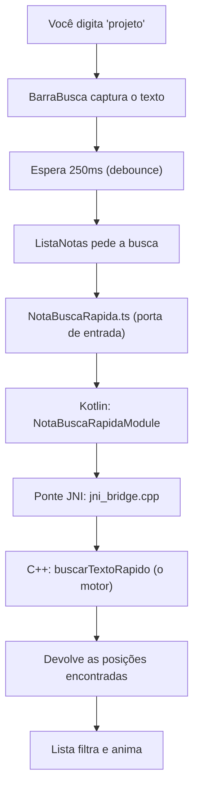
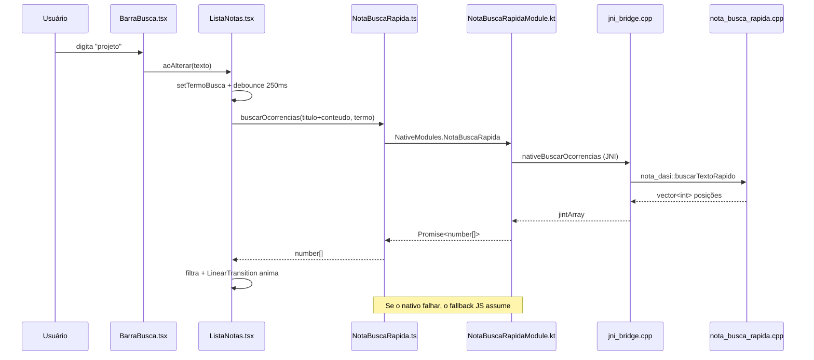

# 📓 NotaDASI — Documentação Completa

> [!abstract] O que é este documento
> Guia completo do app **NotaDASI**: o que cada função faz, como melhorar cada uma delas e onde encaixar novos recursos (incluindo **reordenação de lista**).
> O documento tem **dois níveis de leitura**: primeiro a versão **para leigos**, depois o **tópico base** (técnico). Leia na ordem se você é novo no projeto; pule direto para a parte técnica se já programa.

---

# 🧩 MÓDULO 1 — PARA LEIGOS

> [!tip] Como ler esta parte
> Aqui nada é código. São analogias para entender **por que** o projeto tem três linguagens diferentes conversando entre si.

## 1.1 O que o app faz

O NotaDASI mostra uma lista de **notas** (ideias, listas e projetos) em cartões bonitos, e tem uma **barra de busca** no topo. Você digita uma palavra e a lista filtra sozinha, com animação.

## 1.2 As três camadas, explicadas com uma analogia

Imagine um **restaurante**:

| Camada | No restaurante | No app | Arquivos |
|---|---|---|---|
| **React Native (TypeScript)** | O salão: mesas, cardápio, garçom | Tudo que você **vê e toca**: cartões, cores, animações | `App.tsx`, `src/` |
| **Kotlin (Android)** | O garçom que leva o pedido à cozinha | O **mensageiro** entre a tela e o motor pesado | `NotaBuscaRapidaModule.kt` |
| **C++ (NDK)** | A cozinha industrial | O **motor bruto**: faz a busca no texto muito rápido | `cpp/` |

> [!info] Por que não fazer tudo em uma linguagem só?
> Porque cada uma é boa em uma coisa. JavaScript é ótimo para montar telas, mas lento para processar milhões de caracteres. C++ é rapidíssimo para processar texto, mas horrível para desenhar interfaces. O Kotlin serve de ponte entre os dois mundos.

## 1.3 O caminho de uma busca (passo a passo)



> [!question] O que é "debounce"?
> É esperar você parar de digitar antes de buscar. Sem isso, digitar "projeto" faria **7 buscas** (uma por letra). Com isso, faz **1**.

## 1.4 Glossário rápido

> [!note] Termos que aparecem no resto do documento
> - **JNI** — "Java Native Interface". O tradutor oficial entre Kotlin/Java e C++.
> - **`.so`** — arquivo de biblioteca C++ já compilada (o "motor" pronto para uso).
> - **ABI** — o "sotaque" do processador. Celulares diferentes (ARM, Intel) precisam de versões diferentes do mesmo motor.
> - **Bundle** — todo o código JavaScript empacotado em um arquivo só.
> - **Metro** — o servidor que monta esse bundle enquanto você desenvolve.
> - **Fallback** — o "plano B". Se o motor C++ falhar, o app usa uma versão em JavaScript e continua funcionando.

---

# ⚙️ MÓDULO 2 — TÓPICO BASE (TÉCNICO)

## 2.1 Stack

| Item | Versão / Escolha |
|---|---|
| React Native | 0.87.1 (**Nova Arquitetura**, bridgeless, Hermes) |
| React | 19.2.3 |
| TypeScript | 6.x |
| Animações | `react-native-reanimated` 4.x + `react-native-worklets` |
| C++ | C++17, NDK 27.1.12297006, CMake 3.22.1 |
| Kotlin | 2.2.0 |
| Package Android | `com.notadasi` |

## 2.2 Mapa de arquivos

```
App.tsx                                    Raiz do app (SafeAreaProvider + StatusBar)
index.js                                   Registro no AppRegistry
src/
├── components/
│   ├── ListaNotas.tsx                     Tela principal: lista + estado da busca
│   └── BarraBusca.tsx                     Campo de busca (componente controlado)
├── data/
│   └── notas.ts                           Fonte única de dados e tipos
└── native/
    └── NotaBuscaRapida.ts                 Wrapper do módulo nativo + fallback JS
cpp/
├── nota_busca_rapida.h / .cpp             Lógica pura em C++
├── jni_bridge.cpp                         Ponte JNI (C++ ↔ Kotlin)
└── CMakeLists.txt                         Build da libnota_busca_rapida.so
android/app/src/main/
├── jni/CMakeLists.txt                     ⚠️ Integra o CMake do RN + o nosso
├── java/com/notadasi/
│   ├── MainApplication.kt                 Registra o NotaBuscaRapidaPackage
│   ├── MainActivity.kt                    Activity raiz do RN
│   ├── NotaBuscaRapidaModule.kt           Módulo nativo exposto ao JS
│   └── NotaBuscaRapidaPackage.kt          Empacota o módulo para o RN
└── res/layout/nota_header.xml             Layout XML nativo (referência)
```

---

## 2.3 Referência de funções

### 📄 `src/data/notas.ts` — Fonte de dados

| Símbolo | Linha | O que é |
|---|---|---|
| `TipoCategoria` | 1 | União de tipos: `'ideia'`, `'lista'`, `'projeto'` |
| `Prioridade` | 2 | União de tipos: `'alta'`, `'media'`, `'baixa'` |
| `Nota` | 4 | Formato de uma nota (`id`, `titulo`, `conteudo`, `categoria`, `data`, `prioridade`) |
| `notasExemplo` | 13 | Array com 4 notas de exemplo |

> [!warning] Como melhorar
> - `data` é `string` livre (`'Hoje'`, `'3 dias'`) — **não é ordenável nem comparável**. Trocar por `Date` ou timestamp `number` e formatar só na exibição.
> - Os dados são fixos no código. Substituir por persistência real: **SQLite**, **MMKV** ou **AsyncStorage**.
> - Adicionar campo `ordem: number` para permitir reordenação manual (ver [[#2.7 Onde implementar reordenação da lista]]).

---

### 📄 `src/native/NotaBuscaRapida.ts` — Ponte com o mundo nativo

| Função | Linha | O que faz |
|---|---|---|
| `normalizarTexto(texto)` | 8 | Converte para minúsculas (espelha a função C++ de mesmo nome) |
| `buscarOcorrenciasEmJs(textoCompleto, termoBusca)` | 10 | Busca em JS puro; devolve **array de posições** onde o termo aparece |
| `descriptografarSimuladoEmJs(texto)` | 29 | Desloca cada byte em −3 (espelho JS da função C++) |
| `fallbackJs` | 37 | Objeto que agrupa as duas implementações JS |
| `moduloNativo` | 44 | Referência a `NativeModules.NotaBuscaRapida` (só no Android) |
| `NotaBuscaRapida` (export) | 49 | **API pública**: tenta o nativo, cai no fallback se falhar |

> [!success] Por que existe o fallback
> Se o `.so` não estiver na ABI do aparelho, ou o módulo não estiver registrado, a busca **continua funcionando** em JS em vez de quebrar a tela.

> [!warning] Como melhorar
> - `normalizarTexto` **não remove acentos**: buscar `estrategia` não acha `Estratégia`. Corrigir com `normalize('NFD')` + remoção da faixa de diacríticos — **e fazer o mesmo no C++**, senão as duas implementações divergem.
> - Migrar de `NativeModules` (legado, via camada de interop) para **TurboModule com Codegen**: ganha tipagem gerada e chamadas síncronas via JSI.
> - Adicionar telemetria: hoje o `catch` é silencioso; logar quando cair no fallback ajuda a detectar quebra do nativo.

---

### 📄 `src/components/ListaNotas.tsx` — Tela principal

| Função | Linha | O que faz |
|---|---|---|
| `corPorCategoria` | 15 | Mapa categoria → cor de destaque |
| `corPorPrioridade` | 21 | Mapa prioridade → cor do badge |
| `carregarNotas()` | 27 | Devolve as notas (hoje só retorna `notasExemplo`) |
| `notaCorresponde(nota, termo)` | 29 | Pergunta ao motor nativo se o termo existe em `titulo + conteudo` |
| `formatarResumo(texto, limite=92)` | 38 | Corta o texto e adiciona reticências |
| `obterTextoCategoria(categoria)` | 46 | Converte a chave em rótulo exibível (`ideia` → `Ideia`) |
| `abrirNota(nota)` | 56 | **Stub**: só faz `console.log` |
| `renderizarNota({item, index})` | 60 | Renderiza um cartão animado (entrada escalonada + ripple) |
| `ListaNotas` | 105 | Componente: estado da busca, debounce e filtragem |
| ↳ `executarBusca(termo)` | 110 | Roda a busca em paralelo (`Promise.all`) e guarda os IDs achados |
| ↳ `useEffect` (debounce) | 133 | Dispara a busca 250 ms após a última tecla |
| ↳ `notasVisiveis` | 141 | Lista final exibida (todas, ou só as que casaram) |

> [!warning] Como melhorar
> - **`abrirNota` não faz nada**: implementar navegação (`@react-navigation/native`) para uma tela de detalhe/edição.
> - **Busca em N chamadas nativas**: uma chamada por nota. Com 10 000 notas são 10 000 travessias da ponte. Melhor: **um único método nativo** que receba a lista inteira e devolva os IDs (`filtrarNotas(termo, notas)`).
> - **`notasVisiveis` usa `includes()`** dentro de `filter()` → O(n²). Trocar `idsCorrespondentes` por um `Set<string>` → O(n).
> - **`renderizarNota` está fora do componente**, então não consegue acessar props/estado. Ao adicionar `onPress` real, envolver em `useCallback` e memoizar o cartão com `React.memo`.
> - **Cores hardcoded**: extrair `corPorCategoria`/`corPorPrioridade` para um `tema.ts` central, preparando modo claro/escuro.
> - **Sem `getItemLayout` na FlatList**: com listas longas, adicionar melhora muito o scroll.

---

### 📄 `src/components/BarraBusca.tsx` — Campo de busca

| Símbolo | Linha | O que faz |
|---|---|---|
| `Props` | 4 | `valor`, `aoAlterar(texto)`, `aoPesquisar()` |
| `BarraBusca` | 10 | `TextInput` controlado + botão "Buscar" |

> [!warning] Como melhorar
> - Não há **botão de limpar** nem ícone de lupa.
> - Falta acessibilidade: `accessibilityLabel`, `accessibilityRole="search"`.
> - Adicionar `returnKeyType="search"` + `onSubmitEditing={aoPesquisar}` para buscar pelo teclado.
> - O botão "Buscar" é redundante hoje (a busca já é automática) — pode virar botão de **filtro** ou **ordenação**.

---

### 📄 `cpp/nota_busca_rapida.cpp` — Motor C++

| Função | Linha | O que faz |
|---|---|---|
| `nota_dasi::normalizarTexto(texto)` | 8 | Converte para minúsculas byte a byte |
| `nota_dasi::buscarTextoRapido(texto, termo)` | 19 | Acha **todas** as ocorrências; devolve `vector<int>` de posições |
| `nota_dasi::descriptografarTextoSimulado(texto)` | 39 | Desloca cada byte em −3 |

> [!danger] Atenção de segurança
> `descriptografarTextoSimulado` é uma **cifra de César didática**, não criptografia. Não use para proteger nada real. Para criptografia de verdade: **libsodium** ou o **Android Keystore**.

> [!warning] Como melhorar
> - `normalizarTexto` usa `std::tolower` byte a byte → **quebra em UTF-8**: "É" (2 bytes) não vira "é". Usar **ICU** ou normalização Unicode adequada.
> - Busca usa `std::string::find` → O(n·m) no pior caso. Para textos grandes, implementar **Boyer–Moore–Horspool** ou **KMP**.
> - `buscarTextoRapido` devolve `vector<int>`; `size_t` seria mais correto para posições.
> - `descriptografarTextoSimulado` pode fazer *underflow* com bytes menores que 3. Usar aritmética modular.
> - **Sem testes**: adicionar GoogleTest para a lógica pura em C++.

---

### 📄 `cpp/jni_bridge.cpp` — Ponte JNI

| Função | Linha | O que faz |
|---|---|---|
| `jstringParaStdString(env, valor)` | 7 | Converte `jstring` (Java) para `std::string` (C++), liberando a memória |
| `Java_..._nativeBuscarOcorrencias` | 24 | Chama `buscarTextoRapido` e devolve um `jintArray` |
| `Java_..._nativeDescriptografarSimulado` | 40 | Chama `descriptografarTextoSimulado` e devolve `jstring` |

> [!info] Como o JNI acha essas funções
> Pelo **nome do símbolo**: `Java_` + pacote + classe + método. Por isso, se você renomear o pacote `com.notadasi` ou a classe `NotaBuscaRapidaModule`, **precisa renomear estas funções em C++ também**, senão dá `UnsatisfiedLinkError`.

> [!warning] Como melhorar
> - `GetStringUTFChars` usa **UTF-8 modificado** do JNI; para texto com emojis, considerar conversão explícita.
> - Não há checagem de `NewIntArray` retornando nulo (falta de memória).
> - Registrar os métodos via `RegisterNatives` no `JNI_OnLoad` deixaria o vínculo independente do nome do símbolo.

---

### 📄 `android/.../NotaBuscaRapidaModule.kt` — Módulo nativo

| Membro | Linha | O que faz |
|---|---|---|
| `getName()` | 13 | Nome visto pelo JS: `"NotaBuscaRapida"` |
| `buscarOcorrencias(texto, termo, promise)` | 16 | Converte `IntArray` para `WritableArray` e resolve a Promise |
| `descriptografarSimulado(texto, promise)` | 33 | Idem para string |
| `nativeBuscarOcorrencias` / `nativeDescriptografarSimulado` | 46-47 | Declarações `external` resolvidas via JNI |
| `bibliotecaCarregada` | 56 | Carrega o `.so` **dentro de try/catch** |

> [!success] Decisão de projeto importante
> O `System.loadLibrary` está protegido por `try/catch`. Se a biblioteca não existir para aquela ABI, o app **não quebra**: as Promises rejeitam e o TypeScript cai no fallback JS.

> [!warning] Como melhorar
> - Migrar para **TurboModule** (`ReactContextBaseJavaModule` é a API legada, usada aqui via camada de interop).
> - As chamadas rodam na thread do módulo; para textos grandes, mover para uma **coroutine/executor** dedicado.
> - Expor um método `estaDisponivel()` para o JS saber se está no caminho nativo ou no fallback.

---

### 📄 Demais arquivos

| Arquivo | Papel | Ponto de atenção |
|---|---|---|
| `NotaBuscaRapidaPackage.kt` | Entrega o módulo ao RN | `ReactPackage` é API legada; o override é marcado como *deprecated* |
| `MainApplication.kt` | Registra o package | O `add(NotaBuscaRapidaPackage())` é o que "liga" tudo |
| `MainActivity.kt` | Activity raiz | `getMainComponentName()` **deve** bater com o `app.json` |
| `App.tsx` | Raiz React | Usa `SafeAreaProvider` (o `SafeAreaView` do core é *deprecated*) |
| `res/layout/nota_header.xml` | Referência de layout nativo | **Não é inflado** por ninguém; é demonstração |

---

## 2.4 ⚠️ Armadilha crítica do build (aprendida na prática)

> [!danger] Nunca aponte o `externalNativeBuild` do `:app` direto para o seu CMakeLists
> O plugin do React Native só configura o CMake dele **se o app não tiver configurado um** (`NdkConfiguratorUtils.kt`):
> ```kotlin
> if (ext.externalNativeBuild.cmake.path == null) { /* usa o CMake do RN */ }
> ```
> Se você apontar para o seu próprio arquivo, a **`libappmodules.so` nunca é construída** → os TurboModules do core (`PlatformConstants`, `SourceCode`) somem → **tela preta** com:
> ```
> TurboModuleRegistry.getEnforcing(...): 'PlatformConstants' could not be found
> AppRegistryBinding::startSurface failed. Global was not installed.
> ```

**Solução correta** — em `android/app/src/main/jni/CMakeLists.txt`:

```cmake
cmake_minimum_required(VERSION 3.13)
project(appmodules)

# 1) O React Native primeiro: gera a libappmodules.so
include(${REACT_ANDROID_DIR}/cmake-utils/ReactNative-application.cmake)

# 2) Depois o nosso C++: gera a libnota_busca_rapida.so
add_subdirectory(${CMAKE_CURRENT_SOURCE_DIR}/../../../../../cpp nota_dasi)
```

E em `android/app/build.gradle`:

```gradle
externalNativeBuild {
    cmake {
        path "src/main/jni/CMakeLists.txt"
        version "3.22.1"
    }
}
```

> [!failure] Detalhe que quebra silenciosamente
> **Não coloque nenhum `.cpp` na pasta `jni/`.** O `ReactNative-application.cmake` faz `file(GLOB *.cpp)` nessa pasta: se achar qualquer arquivo, ele **deixa de usar o `OnLoad.cpp` padrão do RN** e o app volta a quebrar.

---

## 2.5 Roteiro de melhorias (priorizado)

> [!todo] Curto prazo
> - [ ] Normalizar acentos na busca (JS **e** C++ juntos)
> - [ ] Trocar `idsCorrespondentes` por `Set<string>`
> - [ ] Implementar `abrirNota` com navegação real
> - [ ] Botão de limpar na `BarraBusca` + acessibilidade

> [!todo] Médio prazo
> - [ ] Persistência real (SQLite/MMKV) no lugar de `notasExemplo`
> - [ ] CRUD completo: criar, editar, excluir nota
> - [ ] Um único método nativo `filtrarNotas` (1 travessia da ponte em vez de N)
> - [ ] `data: Date` em vez de string livre

> [!todo] Longo prazo
> - [ ] Migrar para **TurboModule com Codegen**
> - [ ] Testes: GoogleTest (C++) + React Native Testing Library (JS)
> - [ ] Criptografia real (libsodium / Android Keystore)
> - [ ] Modo claro/escuro com tema central

---

## 2.6 Comandos úteis

```bash
npm install                    # dependências JS
npm start                      # servidor Metro
npm run android                # build + instalar + abrir
npx tsc --noEmit               # checagem de tipos
npx jest                       # testes
npx eslint .                   # lint

cd android && ./gradlew assembleDebug    # gerar APK debug
cd android && ./gradlew --stop           # matar daemons (resolve lock de arquivo no Windows)
```

Ver logs só do app:

```bash
adb logcat --pid=$(adb shell pidof com.notadasi)
```

> [!bug] Erro comum no Windows
> `Unable to delete directory ... mergeDebugNativeLibs` acontece quando **dois builds rodam ao mesmo tempo** (ex.: `npm run android` junto com outro Gradle aberto). Rode `./gradlew --stop` e tente de novo.

---

## 2.7 Onde implementar reordenação da lista

> [!question] Sobre o termo "DOM"
> React Native **não tem DOM** (isso é web). O equivalente aqui é a **árvore de views nativas**, e ela é reordenada quando você **reordena o array de dados** — nunca manipulando views diretamente. A boa notícia: a animação de reordenação **já está pronta** no projeto.

### O que já existe

Em `src/components/ListaNotas.tsx`, linha 69:

```tsx
layout={LinearTransition.springify()}
```

Esse `layout` faz o Reanimated **animar sozinho** qualquer mudança de posição. Ou seja: você só mexe nos dados, e a animação sai de graça.

### Ponto exato de implementação

O lugar é o `useMemo` de `notasVisiveis` (linha ~141). Hoje ele só **filtra**; basta encadear uma **ordenação**:

```tsx
type CriterioOrdenacao = 'prioridade' | 'recentes' | 'alfabetica' | 'manual';

const pesoPrioridade: Record<Prioridade, number> = { alta: 0, media: 1, baixa: 2 };

// Reordena SEM mutar o array original (importante: sort() muta!).
const reordenarNotas = (notas: Nota[], criterio: CriterioOrdenacao): Nota[] => {
  const copia = [...notas];

  switch (criterio) {
    case 'prioridade':
      return copia.sort((a, b) => pesoPrioridade[a.prioridade] - pesoPrioridade[b.prioridade]);
    case 'alfabetica':
      return copia.sort((a, b) => a.titulo.localeCompare(b.titulo, 'pt-BR'));
    case 'manual':
      return copia.sort((a, b) => a.ordem - b.ordem);   // exige campo 'ordem' em Nota
    default:
      return copia;
  }
};

// Dentro do componente:
const [criterio, setCriterio] = useState<CriterioOrdenacao>('prioridade');

const notasVisiveis = useMemo(() => {
  const filtradas =
    idsCorrespondentes === null
      ? notas
      : notas.filter((nota) => idsCorrespondentes.includes(nota.id));

  return reordenarNotas(filtradas, criterio);   // ← reordenação entra aqui
}, [notas, idsCorrespondentes, criterio]);
```

> [!important] Duas regras de ouro
> 1. **Nunca use `sort()` direto no estado** — ele muta o array e o React não detecta a mudança. Sempre `[...notas].sort(...)`.
> 2. **O `keyExtractor` já está correto** (`nota.id`). É ele que permite ao React saber que um item *se moveu* em vez de *foi recriado* — sem isso, a animação de reordenação não funciona.

### Para arrastar-e-soltar (drag & drop)

| Biblioteca | Quando usar |
|---|---|
| `react-native-draggable-flatlist` | Caminho mais rápido; troca a `FlatList` direto |
| `react-native-reanimated` + `react-native-gesture-handler` | Controle total, mais trabalho |

Fluxo: `onDragEnd` devolve o array já reordenado → você salva o novo campo `ordem` de cada nota → persiste → o `LinearTransition` anima a mudança.

### Onde NÃO fazer

> [!failure] Anti-padrões
> - Reordenar dentro de `renderizarNota` — ela renderiza **um** item, não conhece a lista.
> - Guardar a lista ordenada em um `useState` separado — vira duas fontes de verdade que saem de sincronia. Derive com `useMemo`.
> - Tentar mexer na árvore de views nativas "na mão" — não existe `appendChild` aqui.

---

## 2.8 Fluxo completo (referência técnica)



---

> [!quote] Resumo em uma frase
> A tela é React Native, o motor de busca é C++, o Kotlin é o carteiro entre os dois — e se o carteiro sumir, o JavaScript entrega a carta sozinho.
