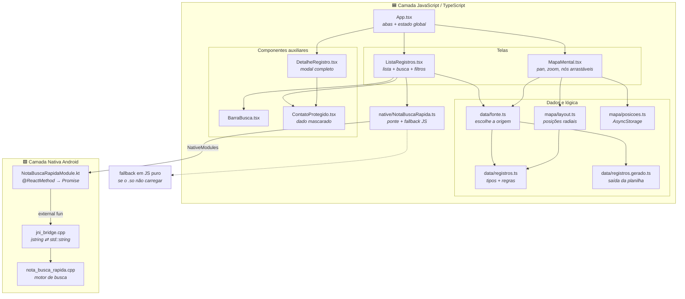
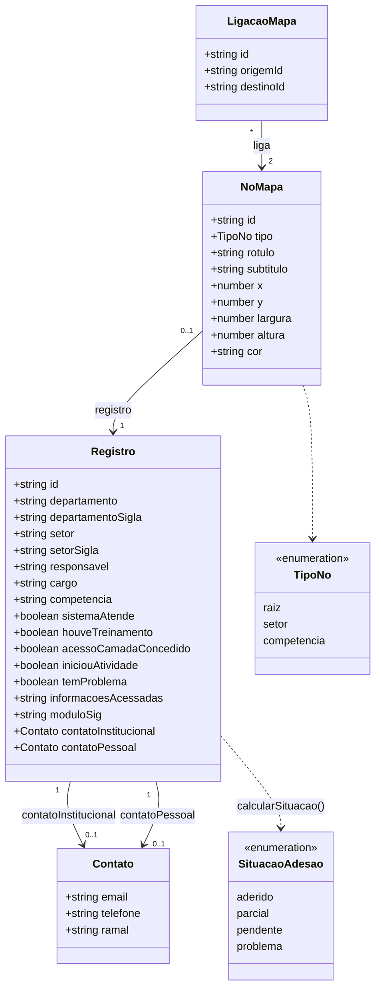
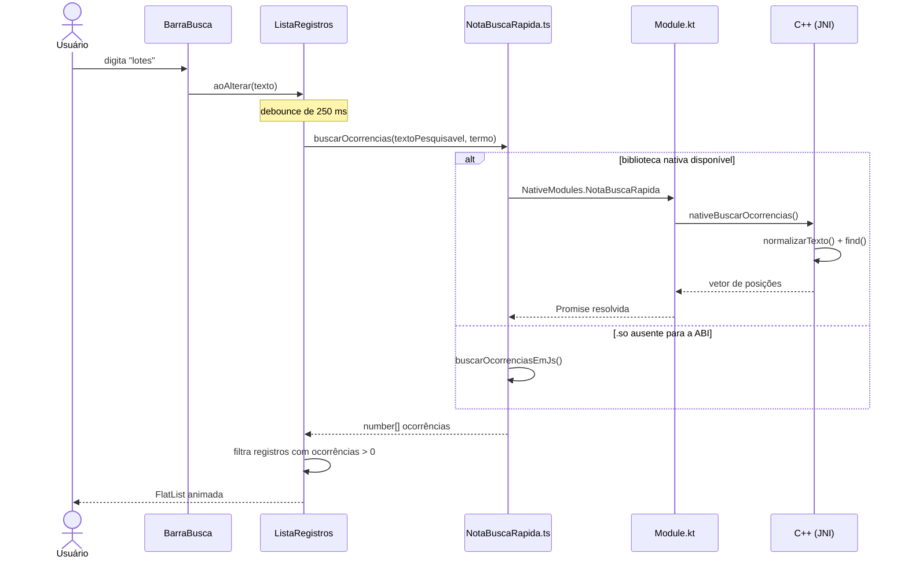

# NotaDASI

Aplicativo Android para consulta do **levantamento de competências e adesão ao SIG** (Prefeitura de Porto Velho). Cada registro é uma competência de um setor, com as respostas sobre como o SIG atende (ou não) aquela atividade.

O app combina três camadas de tecnologia:

- **React Native (TypeScript)** — interface, lista de competências, mapa mental interativo e animações (`react-native-reanimated`).
- **C++ (NDK/CMake)** — busca de texto normalizada (sem acento, case-insensitive), exposta ao JavaScript via módulo nativo (JNI).
- **XML nativo (Android)** — layout de cabeçalho de referência para componentes nativos customizados.

---

## Visão geral (mapa mental da arquitetura)



### Modelo de dados (visão UML)



> Os campos `boolean` de `Registro` são **opcionais** no TypeScript: `undefined` significa *"não respondido"* (o `-` da planilha), que é diferente de `false`. Toda a UI trata os três estados — `Sim` / `Não` / `—`.

### Fluxo de uma busca (ponta a ponta)



---

## Estrutura do projeto

```
App.tsx                            Abas (Lista / Mapa) + registro selecionado
index.js                           Entrada do React Native (AppRegistry)

src/
  components/
    ListaRegistros.tsx             Tela de lista: busca, filtros por setor, cartões
    BarraBusca.tsx                 Campo de texto + botão Buscar
    DetalheRegistro.tsx            Modal com todos os campos do registro
    ContatoProtegido.tsx           Contato pessoal mascarado (toque para revelar)
  data/
    registros.ts                   Tipos (Registro, Contato), regras e dados de exemplo
    fonte.ts                       Decide entre dados da planilha e dados de exemplo
    registros.gerado.ts            Gerado pelo script de importação (não editar à mão)
  mapa/
    MapaMental.tsx                 Tela do mapa: câmera (pan/zoom) e nós arrastáveis
    layout.ts                      Monta os nós/ligações e calcula o layout radial
    posicoes.ts                    Persiste as posições arrastadas (AsyncStorage)
  native/
    NotaBuscaRapida.ts             Ponte com o módulo nativo + fallback em JS puro

cpp/
  nota_busca_rapida.h/.cpp         Busca normalizada e descriptografia simulada
  jni_bridge.cpp                   Ponte JNI (Kotlin ⇄ C++)
  CMakeLists.txt                   Build da libnota_busca_rapida.so

android/
  app/src/main/jni/CMakeLists.txt  Integra o CMake do React Native + o nosso C++
  app/src/main/java/com/notadasi/
    NotaBuscaRapidaModule.kt       Módulo nativo exposto ao JS
    NotaBuscaRapidaPackage.kt      Registro do módulo
    MainApplication.kt             Registro do package no React Native
    MainActivity.kt                Activity principal
  app/src/main/res/
    mipmap-*/ic_launcher.png       Ícones do app
    layout/nota_header.xml         Referência de cabeçalho nativo
    drawable/fundo_header.xml      Fundo do cabeçalho

scripts/
  importacao_de_xlsx.py            Converte a planilha do levantamento em TypeScript
```

---

## As duas telas

| Tela | O que faz |
|---|---|
| **Lista** | Cartões por competência, coloridos pela situação (Aderido / Parcial / Pendente / Com problema). Busca por texto (com C++ por trás) e filtro por sigla de setor. Tocar num cartão abre o detalhe completo. |
| **Mapa mental** | Grafo em três níveis: **Departamento → Setores → Competências**. Arrastar o fundo faz *pan*, pinça faz *zoom*, cada nó pode ser reposicionado e a posição fica salva. Tocar num setor expande/recolhe as competências dele. Linhas tracejadas amarelas ligam competências de **setores diferentes que usam a mesma camada do SIG**. |

---

## Pré-requisitos

- Node.js 22.11+
- JDK 17
- Android SDK com **NDK** e **CMake** (necessários para compilar `cpp/`)
- Emulador Android ou aparelho físico conectado

## Como rodar

```bash
npm install
npm run android
```

O Gradle compila a biblioteca nativa automaticamente — não há passo manual de compilação do C++.

> **Rede bloqueando o registro do npm?** Em algumas redes corporativas/governamentais o domínio `registry.npmjs.org` fica inacessível (timeout), mesmo com `github.com` e `nodejs.org` normais. Se o `npm install` travar ou falhar com `ECONNRESET`, use o mirror oficial do Yarn (mesmos pacotes):
> ```bash
> npm install --registry=https://registry.yarnpkg.com/
> ```

### Gerando o bundle JS manualmente

O `npm run android` já empacota o bundle via Gradle. Para gerar o bundle de produção sem rodar o build completo:

```bash
npx react-native bundle \
  --platform android \
  --dev false \
  --entry-file index.js \
  --bundle-output android/app/src/main/assets/index.android.bundle \
  --assets-dest android/app/src/main/res
```

O conteúdo gerado em `android/app/src/main/assets/` é **artefato de build** — está no `.gitignore` e é recriado a cada release.

### Importando a planilha real

```bash
npm run importar-xlsx -- sua_planilha.xlsx --ts src/data/registros.gerado.ts
```

Enquanto `registros.gerado.ts` não existir, o app usa os dados de exemplo de `registros.ts` e exibe "dados de exemplo" no subtítulo.

---

## ⚠️ Armadilha crítica do build nativo

O `externalNativeBuild` do módulo `:app` aponta para `android/app/src/main/jni/CMakeLists.txt`, que **primeiro** inclui o CMake do React Native (gerando a `libappmodules.so`) e **só depois** adiciona o nosso `cpp/`.

Se você apontar direto para `cpp/CMakeLists.txt`, o React Native deixa de gerar a `libappmodules.so` e o app abre com **tela preta**. Detalhes em `DOCUMENTACAO.md`, seção 2.4.

---

## Observações importantes

- `descriptografarTextoSimulado` (em `cpp/nota_busca_rapida.cpp`) é **uma simulação didática** — um deslocamento de bytes de −3. Não é criptografia e não deve ser usada como mecanismo de segurança.
- `normalizarTexto` existe em duas implementações que **precisam concordar**: a C++ (`nota_busca_rapida.cpp`) e o fallback JS (`NotaBuscaRapida.ts`). Se mudar uma, mude a outra — senão o resultado da busca muda conforme o aparelho.
- Os campos de `Registro` espelham a dataclass do `scripts/importacao_de_xlsx.py`. Ao alterar um lado, altere o outro.
- O layout `res/layout/nota_header.xml` é referência estrutural; ele não é inflado pela `MainActivity` — a tela é renderizada inteiramente pelo React Native.

---

## Documentação complementar

| Arquivo | Conteúdo |
|---|---|
| `TUTORIAL.md` | Tutorial completo: todas as funções explicadas, onde mexer em tamanhos e imagens, e roteiro de melhorias futuras. |
| `DOCUMENTACAO.md` | Documentação histórica do protótipo (módulo para leigos + detalhes do build). |
