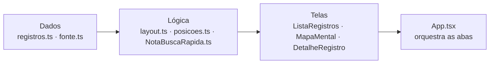

# TUTORIAL — NotaDASI

Guia completo de manutenção do app: **o que cada função faz**, **onde mexer** para mudar tamanhos e imagens, e **o que melhorar** no futuro.

Este documento assume que você já leu o `README.md` (visão geral e diagramas de arquitetura).

## Índice

1. [Como o app se organiza](#1-como-o-app-se-organiza)
2. [Referência de todas as funções](#2-referência-de-todas-as-funções)
3. [Onde mexer em TAMANHOS](#3-onde-mexer-em-tamanhos)
4. [Onde mexer em IMAGENS](#4-onde-mexer-em-imagens)
5. [Reduzindo o tamanho do APK (75 MB → ~15 MB)](#5-reduzindo-o-tamanho-do-apk)
6. [Onde reescrever com segurança](#6-onde-reescrever-com-segurança)
7. [Roteiro de melhorias futuras](#7-roteiro-de-melhorias-futuras)
8. [Receitas rápidas](#8-receitas-rápidas)

---

## 1. Como o app se organiza

Três blocos, com uma regra simples de dependência: **as telas dependem dos dados, nunca o contrário.**



**Regra de ouro:** se você precisa mudar *o que aparece*, mexa em `data/`. Se precisa mudar *como aparece*, mexa nos `StyleSheet.create` dos componentes. Se precisa mudar *como se calcula*, mexa em `mapa/layout.ts` ou no C++.

---

## 2. Referência de todas as funções

### 📄 `src/data/registros.ts` — Tipos e regras de negócio

O coração do modelo. Define o que é um registro e as regras derivadas dele.

| Função / constante | Assinatura | O que faz |
|---|---|---|
| `Registro` | `type` | O registro de UMA competência de um setor: lotação, competência avaliada, respostas sobre o SIG, acessos e contatos. Campos `boolean?` opcionais significam **"não respondido"** (o `-` da planilha) — por isso são `?` e não `false`. |
| `Contato` | `type` | `{ email?, telefone?, ramal? }`. |
| `SituacaoAdesao` | `type` | União: `'aderido' \| 'parcial' \| 'pendente' \| 'problema'`. |
| `rotuloSituacao` | `Record<SituacaoAdesao, string>` | Texto exibido no selo: "Aderido", "Parcial", "Pendente", "Com problema". |
| `corPorSituacao` | `Record<SituacaoAdesao, string>` | Cor hex de cada situação. **Alterar aqui muda a cor em TODA a UI** (cartão, selo, nó do mapa). |
| `calcularSituacao(registro)` | `→ SituacaoAdesao` | Resume o registro em um status único. Ordem de precedência: `temProblema` → `problema`; `sistemaAtende === false` → `pendente`; atende **e** `iniciouAtividade` → `aderido`; senão → `parcial`. |
| `textoPesquisavel(registro)` | `→ string` | Concatena 11 campos (responsável, cargo, setor, siglas, departamento, competência, módulo, camada, observação) num único texto que a busca varre. **Para tornar um campo novo pesquisável, adicione-o a este array.** |
| `registrosExemplo` | `Registro[]` | 5 registros fictícios no formato real, usados quando a planilha ainda não foi importada. |

> ⚠️ Os campos de `Registro` espelham a dataclass do `scripts/importacao_de_xlsx.py`. Mudou um lado? Mude o outro.

---

### 📄 `src/data/fonte.ts` — Origem dos dados

Camada de indireção com uma responsabilidade só: decidir entre dados reais e de exemplo.

| Função | Assinatura | O que faz |
|---|---|---|
| `carregarRegistros()` | `→ Registro[]` | Devolve os registros ativos. Na carga do módulo, tenta `require('./registros.gerado')`; se existir e tiver itens, usa os dados da planilha; senão cai em `registrosExemplo`. |
| `obterOrigemDados()` | `→ 'planilha' \| 'exemplo'` | Diz de onde vieram os dados. A `ListaRegistros` usa isso para mostrar "· dados de exemplo" no subtítulo. |

**Por que um `try/catch` em volta de um `require`?** Porque `registros.gerado.ts` é opcional — só existe depois de rodar o importador. O `catch` vazio é intencional.

---

### 📄 `src/native/NotaBuscaRapida.ts` — Ponte com o C++

Garante que a busca **nunca quebre**, mesmo sem a biblioteca nativa.

| Função | Assinatura | O que faz |
|---|---|---|
| `normalizarTexto(texto)` | `→ string` | Remove acentos (`NFD` + regex de diacríticos) e passa para minúsculas. **Precisa produzir o mesmo resultado que `nota_dasi::normalizarTexto` no C++.** |
| `buscarOcorrenciasEmJs(texto, termo)` | `→ number[]` *(privada)* | Fallback: `indexOf` em laço, devolvendo todas as posições. Avança `posicao + termo.length` para não achar sobreposições. |
| `descriptografarSimuladoEmJs(texto)` | `→ string` *(privada)* | Fallback: desloca cada char code em −3. |
| `NotaBuscaRapida.buscarOcorrencias(texto, termo)` | `→ Promise<number[]>` | **API pública.** Tenta o módulo nativo; em qualquer erro (ou ausência), cai silenciosamente no fallback JS. |
| `NotaBuscaRapida.descriptografarSimulado(texto)` | `→ Promise<string>` | Mesmo padrão de fallback. |

**Padrão importante:** o módulo nativo só é buscado em `Platform.OS === 'android'`. No iOS, `moduloNativo` é `undefined` e o fallback assume — por isso o app funciona nas duas plataformas sem `#ifdef` espalhado pela UI.

---

### 📄 `src/components/ListaRegistros.tsx` — Tela de lista

| Função / componente | O que faz |
|---|---|
| `registroCorresponde(registro, termo)` | `async → boolean`. Chama `NotaBuscaRapida.buscarOcorrencias` sobre o `textoPesquisavel` e devolve `true` se houver ≥ 1 ocorrência. |
| `resumir(texto, limite = 130)` | Trunca com `...` sem cortar espaço no fim (`trimEnd`). Usado no título da competência (130) e no "como atende" (110). |
| `<Indicador rotulo valor>` | Selo Sim/Não/— com cor verde/vermelha/cinza. Trata `undefined` como "—" (não respondido). |
| `<CartaoRegistro registro indice aoSelecionar>` | O cartão. Entra com `FadeInUp` escalonado (`delay = min(indice, 8) * 60` ms — o teto de 8 evita que o item 50 demore 3 s para aparecer) e usa `LinearTransition` para reordenar suavemente. |
| `executarBusca(termo)` | `useCallback` async. Se o termo é vazio, limpa o filtro (`null`); senão roda `Promise.all` sobre todos os registros e guarda os IDs que casaram. |
| `useEffect` do debounce | Aguarda **250 ms** após a última tecla antes de buscar. Cancela com `clearTimeout` no cleanup. |
| `visiveis` (`useMemo`) | Interseção de dois filtros: o da busca (`idsCorrespondentes`) e o do chip de setor (`setorFiltro`). `null` em qualquer um significa "sem filtro". |
| `setores` (`useMemo`) | Lista única e ordenada de siglas, para os chips. |
| `renderizar` | `renderItem` da `FlatList`, memoizado para não recriar a função a cada render. |

---

### 📄 `src/components/BarraBusca.tsx` — Campo de busca

Componente controlado e sem estado próprio: recebe `valor`, `aoAlterar` e `aoPesquisar`. O botão "Buscar" força a busca imediata (contornando o debounce).

---

### 📄 `src/components/DetalheRegistro.tsx` — Modal de detalhe

| Função / componente | O que faz |
|---|---|
| `simNao(valor?)` | `true → "Sim"`, `false → "Não"`, `undefined → "—"`. |
| `rotularUnidade(sigla, nome)` | Junta como `"DICI — Divisão de Controle e Informação"`, ignorando partes vazias. |
| `<Secao titulo>` | Cabeçalho de seção (azul claro, maiúsculas). |
| `<Campo rotulo valor>` | Par rótulo/valor empilhado. |
| `<DetalheRegistro registro aoFechar>` | `Modal` deslizante. Retorna `null` se `registro` for `null` — é assim que o App controla abrir/fechar. Organiza os campos em 5 seções: Lotação, Atendimento pelo SIG, Camadas, Módulo, Problemas. |

---

### 📄 `src/components/ContatoProtegido.tsx` — Dado sensível

| Função | O que faz |
|---|---|
| `mascarar(texto)` | Troca letras e dígitos por `•`, **preservando pontuação e tamanho** (`(69) 9••••-••••`). |
| `<ContatoProtegido contato>` | Mostra mascarado; toque alterna revelar/ocultar. Retorna `null` se não houver e-mail nem telefone. Tem `accessibilityLabel` descritivo. |

**Motivação:** o acesso é liberado para a DASI e a chefia, mas o borrão evita exposição acidental em tela compartilhada/projetada.

---

### 📄 `src/mapa/layout.ts` — Motor do mapa mental

| Função / constante | O que faz |
|---|---|
| `TipoNo` | `'raiz' \| 'setor' \| 'competencia'`. |
| `NoMapa` | Nó posicionado: id, tipo, rótulo, subtítulo, pai, `x/y`, `largura/altura`, cor e o `Registro` de origem (só em competências). |
| `LigacaoMapa` | `{ id, origemId, destinoId }` — uma aresta. |
| `LARGURA_*` / `ALTURA_*` | Dimensões dos três tipos de nó. **Ver [seção 3](#3-onde-mexer-em-tamanhos).** |
| `PALETA` | 7 cores cíclicas para os setores (`indice % 7`). |
| `montarMapa(registros, setoresExpandidos)` | **A função central.** Monta os 3 níveis: (1) raiz com a sigla do departamento; (2) um nó por sigla de setor, distribuídos em círculo — ângulo `(i / total) * 2π − π/2`, raio `max(320, nSetores * 90)`; (3) se o setor estiver expandido, as competências em leque de `0.8π` a 300 px do setor. Devolve `{ nos, ligacoes }`. |
| `ligacoesPorCamada(nos)` | Cria as **linhas tracejadas amarelas**: agrupa competências pela camada do SIG (`informacoesAcessadas`), ignora vazio/"nenhuma", e liga **em cadeia** (a→b→c, não todos-com-todos) apenas quando os setores são **diferentes**. É o "vínculo por campo semelhante": quem depende do mesmo dado precisa do mesmo acesso. |

> O layout radial é só **posição inicial**. Assim que o usuário arrasta um nó, `posicoes.ts` passa a mandar.

---

### 📄 `src/mapa/posicoes.ts` — Persistência das posições

| Função | Assinatura | O que faz |
|---|---|---|
| `lerPosicoes()` | `→ Promise<PosicoesSalvas>` | Lê o JSON do AsyncStorage (chave `@notadasi:posicoes-mapa`). Storage indisponível ou JSON corrompido → `{}` (volta ao layout automático). |
| `salvarPosicoes(posicoes)` | `→ Promise<void>` | Grava o mapa `{ [idDoNo]: {x, y} }`. Falha ao salvar **não** derruba a tela. |
| `limparPosicoes()` | `→ Promise<void>` | Apaga tudo — útil para um futuro botão "reorganizar mapa". *(Hoje não é chamada por ninguém.)* |

---

### 📄 `src/mapa/MapaMental.tsx` — Tela do mapa

| Função / componente | O que faz |
|---|---|
| `posicaoDe(no)` | Posição efetiva: a arrastada pelo usuário **vence** o layout automático (`posicoesSalvas[no.id] ?? {x, y}`). |
| `registrarPosicao(id, x, y)` | Atualiza o estado e persiste (efeito colateral dentro do `setState` updater). |
| `alternarSetor(sigla)` | Expande/recolhe um setor, com um `Set` imutável. |
| **Câmera** (`gestoPan`, `gestoPinca`) | `Gesture.Simultaneous` de pan + pinça. O zoom é limitado entre **0.25×** e **2.5×**; a escala inicial é **0.75×**. Os valores vivem em `useSharedValue` (thread de UI, sem re-render). |
| `<LinhasDoMapa>` | Desenha as arestas num `<Svg>` de **4000×4000 px** centrado (deslocado por `-centro`), com `pointerEvents="none"` para não roubar o toque. Linhas sólidas cinza = hierarquia; tracejadas amarelas = mesma camada. |
| `<NoArrastavel>` | Cada nó. `Gesture.Exclusive(arrastar, tocar)` — o toque só dispara se não virou arrasto. Ao soltar, `runOnJS(aoSoltar)` volta à thread JS para salvar. O `useEffect` com `referencia` faz o nó **acompanhar com mola** quando o layout recalcula (ex.: outro setor expandiu). Escala 1.06× enquanto arrasta. |
| Estado `carregado` | Enquanto lê o AsyncStorage, mostra "Montando o mapa..." — evita os nós "pularem" da posição automática para a salva. |

---

### 📄 `cpp/nota_busca_rapida.cpp` — Motor C++

| Função | Assinatura | O que faz |
|---|---|---|
| `dobrarAcentoLatin1(segundoByte)` | `→ char` *(anônima)* | Mapeia o 2º byte das sequências UTF-8 de 2 bytes iniciadas por `0xC3` (faixa Latin-1: á, ã, ç, é, í, ñ, ó, ú…) para o ASCII equivalente. Retorna `'\0'` se não houver equivalente. |
| `normalizarTexto(texto)` | `→ std::string` | Percorre byte a byte; ao ver `0xC3` seguido de byte mapeável, emite o ASCII e consome os dois bytes; senão aplica `tolower`. |
| `buscarTextoRapido(texto, termo)` | `→ std::vector<int>` | Normaliza os dois lados e roda `find` em laço, avançando pelo tamanho do termo. Devolve todas as posições. |
| `descriptografarTextoSimulado(texto)` | `→ std::string` | Desloca cada byte em −3. **Simulação didática, não é criptografia.** |

> **Limitação conhecida:** só trata acentos do bloco `0xC3`. Caracteres fora dele (ex.: `ª`, `º`, aspas tipográficas) passam sem normalizar — o `tolower` byte a byte também não os afeta.

---

### 📄 `cpp/jni_bridge.cpp` — Ponte JNI

Todo o arquivo é guardado por `#if defined(__ANDROID__)`, então compila sem erro em outras plataformas.

| Função | O que faz |
|---|---|
| `jstringParaStdString(env, valor)` | Converte `jstring → std::string`, sempre liberando com `ReleaseStringUTFChars`. Retorna `{}` se `nullptr`. |
| `Java_com_notadasi_NotaBuscaRapidaModule_nativeBuscarOcorrencias` | Converte as entradas, chama `buscarTextoRapido` e devolve um `jintArray`. |
| `Java_com_notadasi_NotaBuscaRapidaModule_nativeDescriptografarSimulado` | Converte, chama `descriptografarTextoSimulado`, devolve `jstring`. |

⚠️ **O nome da função C++ é um contrato com o Kotlin:** `Java_` + pacote com `_` + classe + método. Renomear a classe Kotlin ou mudar o pacote **quebra o link em tempo de execução** (`UnsatisfiedLinkError`) — e aí o app cai no fallback JS silenciosamente.

---

### 📄 `NotaBuscaRapidaModule.kt` — Módulo nativo

| Membro | O que faz |
|---|---|
| `getName()` | Retorna `"NotaBuscaRapida"` — é **esta string** que o JS acessa em `NativeModules.NotaBuscaRapida`. |
| `buscarOcorrencias(texto, termo, promise)` | `@ReactMethod`. Se a lib não carregou, rejeita com `ERRO_BIBLIOTECA_INDISPONIVEL`. Senão converte `IntArray → WritableArray` e resolve. |
| `descriptografarSimulado(texto, promise)` | Mesmo padrão. |
| `bibliotecaCarregada` (companion) | `System.loadLibrary("nota_busca_rapida")` dentro de `try/catch`. **Nunca derruba o app**: se o `.so` não existe para a ABI do aparelho, vira `false` e o JS usa o fallback. |

---

## 3. Onde mexer em TAMANHOS

### 3.1 Tamanho dos nós do mapa mental

**Arquivo:** `src/mapa/layout.ts` (linhas 25–30)

```ts
export const LARGURA_RAIZ = 200;         // caixa do departamento
export const ALTURA_RAIZ = 78;
export const LARGURA_SETOR = 180;        // caixas das siglas (DICI, DICTF...)
export const ALTURA_SETOR = 68;
export const LARGURA_COMPETENCIA = 220;  // caixas das competências
export const ALTURA_COMPETENCIA = 88;
```

Essas constantes são usadas em **dois lugares** e ambos continuam corretos automaticamente:
- ao criar o nó (`largura`/`altura` do `NoMapa`);
- no `NoArrastavel`, que centraliza o nó com `translateX: x - no.largura / 2`.

> A altura vira `minHeight` no estilo, então o nó **cresce** se o texto ocupar mais linhas. Para travar a altura, troque `minHeight: no.altura` por `height: no.altura` em `MapaMental.tsx`.

### 3.2 Espaçamento entre os nós (o mapa está "apertado" ou "espalhado demais")

**Arquivo:** `src/mapa/layout.ts`, dentro de `montarMapa`

| O que ajustar | Linha | Efeito |
|---|---|---|
| `const raioSetores = Math.max(320, siglas.length * 90)` | ~66 | Distância raiz → setores. Aumente o `90` se os setores estiverem colidindo. |
| `const raioCompetencias = 300` | ~97 | Distância setor → competências. |
| `const abertura = Math.PI * 0.8` | ~98 | Ângulo do leque de competências. `Math.PI * 1.2` espalha mais; valores pequenos empilham. |

### 3.3 Zoom e enquadramento inicial

**Arquivo:** `src/mapa/MapaMental.tsx`

```ts
const escala = useSharedValue(0.75);              // zoom inicial (linha ~85)
escala.value = Math.min(2.5, Math.max(0.25, proxima));  // limites (linha ~108)
const deslocX = useSharedValue(larguraTela / 2);  // centro da câmera (linha ~83)
```

Se o mapa tiver muitos setores e "nascer" cortado, baixe a escala inicial para `0.5`.

### 3.4 Área do SVG das linhas

**Arquivo:** `src/mapa/MapaMental.tsx`, em `LinhasDoMapa`

```ts
const TAMANHO = 4000;  // linha ~180
```

O SVG é um quadrado fixo centrado na origem. Se você aumentar muito os raios (3.2) e as linhas começarem a **sumir nas bordas**, aumente este valor — mas lembre que é área de renderização: valores enormes custam memória.

### 3.5 Tamanhos da interface (fontes, cartões, botões)

Todos vivem nos `StyleSheet.create` no fim de cada arquivo:

| Quero mudar | Arquivo | Chave do estilo |
|---|---|---|
| Título "Levantamento SIG" | `ListaRegistros.tsx` | `titulo.fontSize` (28) |
| Texto da competência no cartão | `ListaRegistros.tsx` | `competencia.fontSize` (14) / `lineHeight` (20) |
| Arredondamento e sombra do cartão | `ListaRegistros.tsx` | `cartao.borderRadius` (22), `elevation` (6) |
| Espaço interno do cartão | `ListaRegistros.tsx` | `areaCartao.padding` (18) |
| Altura do campo de busca | `BarraBusca.tsx` | `input.height` (52) |
| Altura máxima do modal | `DetalheRegistro.tsx` | `painel.maxHeight` (`'88%'`) |
| Barra de abas | `App.tsx` | `aba.paddingVertical` (12), `textoAba.fontSize` (12) |
| Fonte dos rótulos do nó | `MapaMental.tsx` | `rotuloNo.fontSize` (13), `rotuloRaiz.fontSize` (18) |

### 3.6 Quantidade de texto exibido

**Arquivo:** `src/components/ListaRegistros.tsx`

```ts
const resumir = (texto: string, limite = 130) => ...   // corte padrão
resumir(registro.comoAtende, 110)                       // corte do "como atende"
```

E no mapa, `layout.ts`: `rotulo: registro.competencia.slice(0, 60)` — o rótulo do nó é cortado em 60 caracteres. O `numberOfLines={2}` no `<Text>` do `MapaMental.tsx` limita a 2 linhas na tela.

---

## 4. Onde mexer em IMAGENS

### 4.1 Ícone do app

**Pasta:** `android/app/src/main/res/mipmap-*/`

| Densidade | Tamanho do PNG | Arquivos |
|---|---|---|
| `mipmap-mdpi` | 48×48 | `ic_launcher.png`, `ic_launcher_round.png` |
| `mipmap-hdpi` | 72×72 | idem |
| `mipmap-xhdpi` | 96×96 | idem |
| `mipmap-xxhdpi` | 144×144 | idem |
| `mipmap-xxxhdpi` | 192×192 | idem |

Substitua os 10 arquivos mantendo os nomes. O nome referenciado está no `AndroidManifest.xml` (`android:icon="@mipmap/ic_launcher"`).

> **Forma recomendada:** Android Studio → botão direito em `res` → *New → Image Asset*. Ele gera todas as densidades e, de quebra, o **ícone adaptativo** (`mipmap-anydpi-v26/ic_launcher.xml` + camadas de fundo/frente), que é o padrão desde o Android 8 e evita o ícone aparecer "colado" na borda.

### 4.2 Nome exibido do app

**Arquivo:** `android/app/src/main/res/values/strings.xml` → `<string name="app_name">`.

### 4.3 Adicionando imagens à interface React Native

Hoje o app **não usa nenhuma imagem** na UI — é tudo texto, cor e SVG. Para adicionar:

**Opção A — imagem local (empacotada no app):**

```tsx
// crie src/assets/logo.png e importe:
import { Image } from 'react-native';

<Image
  source={require('../assets/logo.png')}
  style={{ width: 120, height: 40 }}
  resizeMode="contain"
/>
```

Forneça `logo@2x.png` e `logo@3x.png` ao lado — o React Native escolhe pela densidade da tela automaticamente.

**Opção B — imagem remota (URL):**

```tsx
<Image
  source={{ uri: 'https://…/foto.png' }}
  style={{ width: 64, height: 64, borderRadius: 32 }}
/>
```

Imagens remotas **exigem `width` e `height` explícitos** — sem isso elas renderizam com tamanho zero. Esse é o erro mais comum.

**Opção C — ícones vetoriais:** o projeto já tem `react-native-svg` instalado (usado nas linhas do mapa). Você pode colar o conteúdo de um SVG direto como componente, sem instalar nada novo:

```tsx
import Svg, { Path } from 'react-native-svg';

const IconeAlerta = () => (
  <Svg width={16} height={16} viewBox="0 0 24 24">
    <Path d="M12 2 L22 20 H2 Z" fill="#F9A8D4" />
  </Svg>
);
```

### 4.4 Se cada registro passar a ter uma foto

Três passos, na ordem:

1. **Tipo** — em `src/data/registros.ts`, adicione ao `Registro`:
   ```ts
   fotoUrl?: string;
   ```
2. **Importador** — espelhe o campo na dataclass de `scripts/importacao_de_xlsx.py` (senão o `registros.gerado.ts` nunca terá o campo).
3. **UI** — renderize com fallback, porque o campo é opcional:
   ```tsx
   {registro.fotoUrl ? (
     <Image source={{ uri: registro.fotoUrl }} style={estilos.foto} />
   ) : null}
   ```

> **Cuidado com o tamanho:** se as fotos forem locais e grandes, elas entram no APK. Prefira URLs remotas, ou redimensione para no máximo ~200 KB cada.

---

## 5. Reduzindo o tamanho do APK

O APK atual tem **~75 MB**. Isso não é normal para um app deste porte — a causa é conhecida e tem conserto.

### Causa 1 — quatro arquiteturas num APK só (o maior vilão)

**Arquivo:** `android/gradle.properties`

```properties
reactNativeArchitectures=armeabi-v7a,arm64-v8a,x86,x86_64
```

Cada ABI carrega uma cópia completa das bibliotecas nativas (React Native, Hermes, o nosso `.so`). São **4 cópias** dentro do mesmo arquivo.

**Correção A — gerar um APK por arquitetura.** Em `android/app/build.gradle`, dentro de `android { }`:

```gradle
splits {
    abi {
        enable true
        reset()
        include "armeabi-v7a", "arm64-v8a"
        universalApk false
    }
}
```

Resultado: dois APKs de ~15–20 MB. Aparelhos modernos usam o `arm64-v8a`.

**Correção B — para publicar na Play Store**, use o formato AAB, que já faz esse recorte por conta própria:

```bash
cd android && ./gradlew bundleRelease
```

**Correção C — só para testes locais rápidos:** deixe apenas a ABI que você usa (`arm64-v8a` para celulares atuais, `x86_64` para emulador).

### Causa 2 — minificação desligada

**Arquivo:** `android/app/build.gradle` (linha 60)

```gradle
def enableProguardInReleaseBuilds = false   // ← mude para true
```

E adicione o encolhimento de recursos no bloco `release`:

```gradle
release {
    signingConfig signingConfigs.debug
    minifyEnabled enableProguardInReleaseBuilds
    shrinkResources enableProguardInReleaseBuilds   // ← nova linha
    proguardFiles getDefaultProguardFile("proguard-android-optimize.txt"), "proguard-rules.pro"
}
```

> Depois de ligar o ProGuard, **teste o app de verdade**: minificação pode quebrar reflexão. Se algo sumir, adicione regras `-keep` em `proguard-rules.pro`.

### Causa 3 — assinatura de debug em release

**Arquivo:** `android/app/build.gradle` (linha ~111) — o `release` usa `signingConfigs.debug`. Não afeta o tamanho, mas **impede publicação** e é um risco de segurança. Antes de distribuir, gere um keystore próprio ([documentação oficial](https://reactnative.dev/docs/signed-apk-android)).

### Resumo do ganho esperado

| Ação | Ganho aproximado |
|---|---|
| Split por ABI (ou AAB) | 75 MB → ~20 MB |
| ProGuard + `shrinkResources` | −2 a 5 MB |
| **Combinado** | **~15 MB** |

---

## 6. Onde reescrever com segurança

### ✅ Seguro — mexa à vontade

| Área | Por quê |
|---|---|
| Qualquer `StyleSheet.create` | Puramente visual, sem efeito em lógica. |
| `corPorSituacao` e `rotuloSituacao` | Um lugar só, propaga para toda a UI. |
| `PALETA` em `layout.ts` | Só afeta cor de setor. |
| Constantes `LARGURA_*` / `ALTURA_*` | Usadas de forma consistente. |
| Textos, rótulos e a dica do mapa | Sem dependências. |
| `registrosExemplo` | Só aparece quando não há planilha. |

### ⚠️ Cuidado — exige mudar em par

| Área | O par que precisa acompanhar |
|---|---|
| `normalizarTexto` (JS) | `nota_dasi::normalizarTexto` (C++) — senão a busca muda conforme o aparelho. |
| Campos de `Registro` | A dataclass em `scripts/importacao_de_xlsx.py`. |
| `textoPesquisavel` | Nada quebra, mas campo esquecido = campo não pesquisável. |
| `calcularSituacao` | A ordem das condições **é** a regra de negócio. Reordenar muda resultados. |

### 🚫 Não mexa sem entender a consequência

| Área | Risco |
|---|---|
| Nome da classe/pacote `NotaBuscaRapidaModule` | Quebra o link JNI (`Java_com_notadasi_...`) → `UnsatisfiedLinkError` silencioso. |
| `getName()` do módulo Kotlin | É a chave de `NativeModules.NotaBuscaRapida`. |
| `path "src/main/jni/CMakeLists.txt"` | Apontar direto para `cpp/CMakeLists.txt` faz sumir a `libappmodules.so` → **tela preta**. |
| Chave `@notadasi:posicoes-mapa` | Trocar descarta as posições salvas dos usuários. |
| `try/catch` vazios de `fonte.ts` e `posicoes.ts` | São intencionais: mantêm o app vivo quando o opcional falha. |

---

## 7. Roteiro de melhorias futuras

Ordenado por **valor entregue ÷ esforço**.

### 🥇 Curto prazo

1. **Reduzir o APK** — [seção 5](#5-reduzindo-o-tamanho-do-apk). Maior ganho imediato: 75 MB é um obstáculo real para distribuir por WhatsApp/e-mail.
2. **Botão "reorganizar mapa"** — `limparPosicoes()` já existe em `posicoes.ts` e **nunca é chamada**. É um botão ligando numa função pronta.
3. **Indicador de origem no mapa** — a lista mostra "dados de exemplo", o mapa não. Basta usar `obterOrigemDados()` no `MapaMental.tsx`.
4. **Destacar o trecho encontrado** — `buscarOcorrencias` já devolve as **posições** de cada ocorrência, e hoje o código só usa `length > 0`. Dá para pintar o trecho no cartão sem tocar no C++.

### 🥈 Médio prazo

5. **Testes das regras de negócio** — `calcularSituacao` e `textoPesquisavel` são funções puras, fáceis de testar. O Jest já está configurado (`jest.config.js`), e hoje `__tests__/` está praticamente vazio.
6. **Filtro por situação** — já existe filtro por setor; um filtro por "Pendente / Com problema" responde a pergunta mais frequente do levantamento ("o que falta?").
7. **Tela de resumo** — contagens por setor e por situação. Todos os dados já estão em memória; é agregação simples com `reduce`.
8. **Exportar o que está filtrado** — gerar CSV do resultado da busca para levar a reuniões.

### 🥉 Longo prazo

9. **Busca incremental no C++** — hoje `executarBusca` roda `Promise.all` sobre **todos** os registros a cada tecla, com uma travessia da ponte JNI por registro. Com centenas de registros isso pesa. Alternativas: mandar tudo de uma vez numa chamada só, ou construir um índice invertido no C++.
10. **Normalização Unicode completa no C++** — hoje só o bloco `0xC3`. Uma tabela maior (ou ICU) cobriria todos os casos.
11. **Migrar para a TurboModule API** — `newArchEnabled=true` já está ligado, mas o módulo ainda usa a bridge antiga (`ReactContextBaseJavaModule`). TurboModules dão chamadas síncronas e tipagem gerada por codegen.
12. **Modo claro** — as cores estão espalhadas por 6 `StyleSheet`. Um arquivo `tema.ts` com tokens seria o pré-requisito.
13. **Edição no app** — hoje é somente leitura. Editar exigiria repensar a origem dos dados (`fonte.ts` é read-only por design).

---

## 8. Receitas rápidas

### Trocar a cor de uma situação
`src/data/registros.ts` → `corPorSituacao`. Uma linha, propaga para cartão, selo e nó do mapa.

### Fazer um campo novo ser encontrado pela busca
`src/data/registros.ts` → adicione ao array de `textoPesquisavel`.

### Deixar a busca mais/menos "nervosa"
`src/components/ListaRegistros.tsx` → `setTimeout(..., 250)`. Menor = responde antes, gasta mais CPU.

### Mudar o zoom inicial do mapa
`src/mapa/MapaMental.tsx` → `useSharedValue(0.75)` em `escala`.

### Afastar os setores uns dos outros
`src/mapa/layout.ts` → `Math.max(320, siglas.length * 90)`, aumente o `90`.

### Ver se a busca está usando C++ ou o fallback JS
Em `src/native/NotaBuscaRapida.ts`, ponha um `console.log` dentro do `catch` e outro após o `if (resultado)`. No `adb logcat`, `UnsatisfiedLinkError` indica que o `.so` não foi empacotado para a ABI do aparelho.

### Compilar só para o emulador (build mais rápido)
`android/gradle.properties` → `reactNativeArchitectures=x86_64`.

### Limpar tudo quando o build ficar estranho
```bash
cd android && ./gradlew clean
rm -rf android/app/build android/app/.cxx
npm start -- --reset-cache
```
